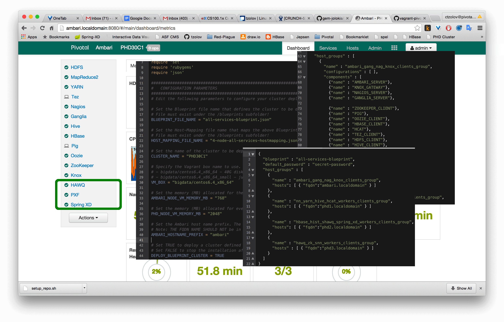

Multi-VMs PivotalHD3.0 (or Hortonworks HDP2.x) Hadoop Cluster with HAWQ and SpringXD
=================
This project leverages Vagrant and [Apache Ambari](https://ambari.apache.org/) to create multi-VMs [PivotalHD 3.0](http://pivotal.io/big-data/pivotal-hd) or Hortonworks HDP2.x Hadoop cluster including [HAWQ 1.3 (SQL on Hadoop)](http://pivotal.io/big-data/pivotal-hawq) and [Spring XD 1.2](http://projects.spring.io/spring-xd/).



The logical structure of the cluster is defined in a [`Blueprint`](blueprints). Related [`Host-Mapping`](blueprints) defines how the blueprint is mapped into physical machines. The [Vagrantfile](Vagrantfile) script provisions Virtual Machines (VMs) for the hosts defined in the `Host-Mapping` and with the help of the [Ambari Blueprint API](https://cwiki.apache.org/confluence/display/AMBARI/Blueprints) deploys the`Blueprint` in the cluster. Vagrant supports PivotalHD3.0 (`PHD`) and Hortonworks 2.x (`HDP`) blueprint stacks. 

The default [All-Services-Blueprint](blueprints#all-services-pivotalhd30-hawq-and-springxd) creates four virtual machines  — one for Apache Ambari and three for the Pivotal HD cluster where Apache Hadoop® (HDFS, YARN, Pig, Zookeeper, HBase), HAWQ (SQL-on-Hadoop) and SpringXD are installed.

## Prerequisite 
* From a hardware standpoint, you need 64-bit architecture, the default blueprint requires at least 16GB of physical memory and around 120GB of free disc space (you can configure with only 24GB of disc space but you will not be able to install all Pivotal services together.
* Install [Vagrant](http://www.vagrantup.com/downloads.html) (1.7.2+).
* Install [VirtualBox](https://www.virtualbox.org/) or VMware Fusion (note that VMWare Fusion requires [paid Vagrant license](http://www.vagrantup.com/vmware)). 

## Environment Setup
* Clone this project
```
git clone https://github.com/tzolov/vagrant-pivotalhd.git
```
* Follow the [Packages download](https://github.com/tzolov/vagrant-pivotalhd/tree/master/packages) instructions to collect all required tarballs and store them inside the `/packages` subfolder.
* Edit the  [Vagrantfile](Vagrantfile) `BLUEPRINT_FILE_NAME` and `HOST_MAPPING_FILE_NAME` properties to select the `Blueprint`/`Host-Mapping` pair to deploy. All blueprints and mapping files are in the [`/blueprint`](blueprints) subfolder. By default the [4 nodes, All-Services](blueprints#all-services-pivotalhd30-hawq-and-springxd) blueprint is used.

## Create Hadoop cluster
From the top directory run
```
vagrant up --provider virtualbox
```
Depends on the blueprint stack either PivotalHD or Hortonworks clusters will be created. The default [`blueprint/host-mapping`](blueprints#all-services-pivotalhd30-hawq-and-springxd) will create 4 Virtual Machines. 
When the `vagrant up` command returns, the VMs are provisioned, the Ambari Server is installed and the cluster deployment is in progress. Open the Ambari interface to monitor the deployment progress:
```
https://10.211.55.100:8080
```
(username: `admin`, password: `admin`)

## Vagrant Configuration Properties

The following [Vagrantfile](Vagrantfile) configuration properties can be used to customize a cluster deployment. 
For instructions how to create a custom `Blueprint` or `Host-Mapping` read the [blueprints](blueprints) section.

<table>
	<thead>
		<tr>
			<th><sub>Property</sub></th>
			<th><sub>Description</sub></th>
			<th><sub>Default Value</sub></th>
		</tr>
	</thead>
	<tbody>
		<tr>
			<td><sub>BLUEPRINT_FILE_NAME</sub></td>
			<td><sub>Specifies the Blueprint file name to deployed. File must exist in the /blueprints subfolder.</sub></td>
			<td><sub>phd-all-services-blueprint.json</sub></td>
		</tr>
		<tr>
			<td><sub>HOST_MAPPING_FILE_NAME</sub></td>
			<td><sub>Specifies the Host-Mapping file name to deployed. File must exist in the /blueprints subfolder.</sub></td>
			<td><sub>4-node-all-services-hostmapping.json</sub></td>
		</tr>
		<tr>
			<td><sub>CLUSTER_NAME</sub></td>
			<td><sub>Sets the cluster name as it will appear in Ambari</sub></td>
			<td><sub>PHD30C1</sub></td>
		</tr>
		<tr>
			<td><sub>VM_BOX</sub></td>
			<td><sub>Vagrant box name to use. Tested options are: (1) bigdata/centos6.4_x86_64 - 40G disk and (2) bigdata/centos6.4_x86_64_small - just 8G of disk space</sub></td>
			<td><sub>bigdata/centos6.4_x86_64</sub></td>
		</tr>
		<tr>
			<td><sub>AMBARI_NODE_VM_MEMORY_MB</sub></td>
			<td><sub>Memory (MB) allocated for the Ambari VM</sub></td>
			<td><sub>768</sub></td>
		</tr>
		<tr>
			<td><sub>PHD_NODE_VM_MEMORY_MB</sub></td>
			<td><sub>Memory (MB) allocated for every PHD VM</sub></td>
			<td><sub>2048</sub></td>
		</tr>
		<tr>
			<td><sub>AMBARI_HOSTNAME_PREFIX</sub></td>
			<td><sub>Set the Ambari host name prefix. The suffix is fixed to '.localdomain'.Note: THE FQDN NAME SHOULD NOT be in the phd[1-N].localdomain range.</sub></td>
			<td><sub>ambari</sub></td>
		</tr>
		<tr>
			<td><sub>DEPLOY_BLUEPRINT_CLUSTER</sub></td>
			<td><sub>Set TRUE to deploy a cluster defined by BLUEPRINT_FILE_NAME and HOST_MAPPING_FILE_NAME. Set to FALSE if you prefer to install the cluster with the Ambari wizard.</sub></td>
			<td><sub>TRUE</sub></td>
		</tr>
	</tbody>	  	
</table>


